# Image classification with pytorch
In this repo, I have built a classifier for classifying ants, bees, cats and dogs. The classifier is built with transfer learning, using a pretrained CNN architecture/model (vgg16, resnet101). The training is performed using Pytorch frame work.   
The training data includes:   

| Class       | Train set | Validation set |
| ----------- | ----------| -------------- |
| Ants        | 123       | 70             |
| Bees        | 121       | 83             |
| Cats        | 125       | 85             |
| Dogs        | 125       | 80             |
      
The data is is just a small subset from all the above mentioned classes

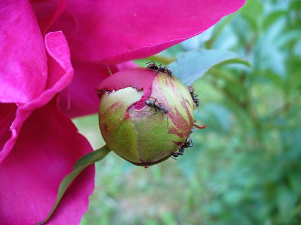 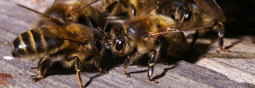
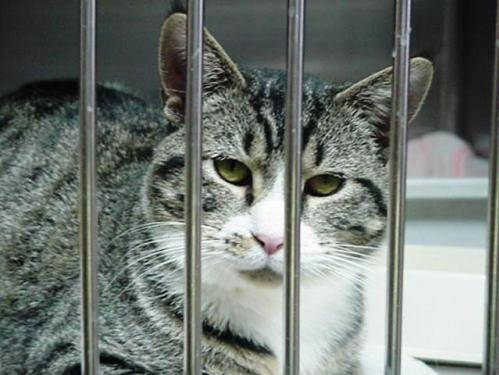 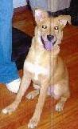   

### Data Preprocessing   
* In the data preprocessing step, I have used albumentation library for image augmentation  
* The class labels (ants, bees, cats, dogs) are mapped to (0,1,2,3) respectively   
### Model Building  
* I have used a pretrained ResNet101 from pytorch model zoo and frozen the feature extraction part and retrained the classifier (Transfer Learning)
### Training & Validation   
* The training script performs training and validation alternatively in a loop   
* The training is integrated with Tensorboard   
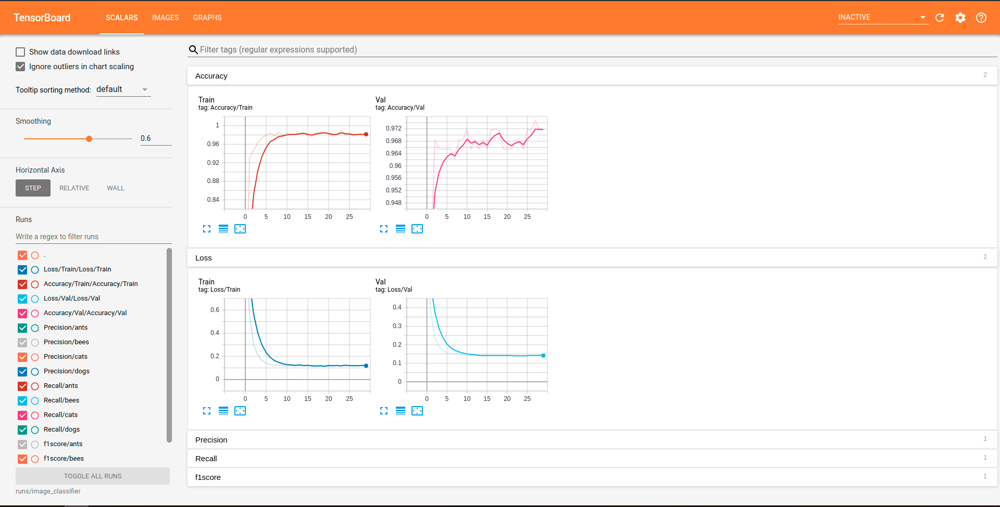    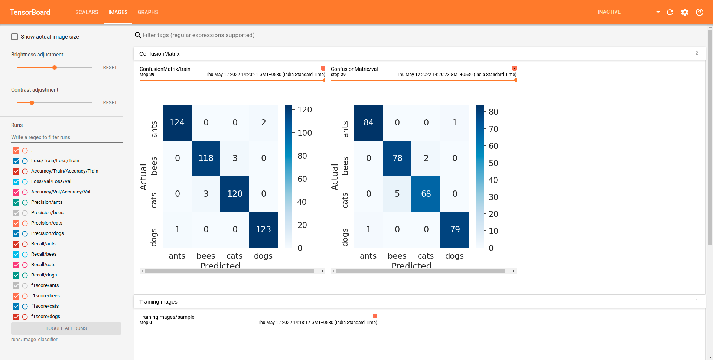   

### Testing   
* A sample of ~300 images are used to test the classifier   
* The results are stored in a csv file with columns - image, label, prediction
* This file is used for computation of evaluation metrics - Confusion matrix, ROC-AUC plot ,f1-score, log loss   
F1 score: 0.89   
Log loss: 0.33   
### Confusion matrix  
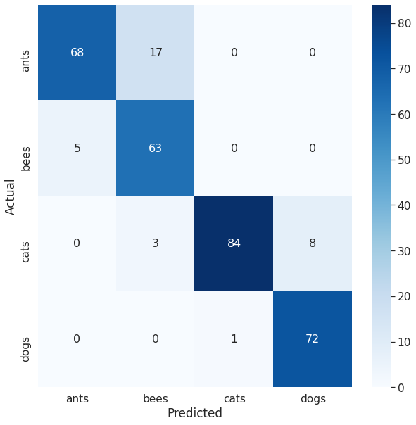    

### ROC-AUC     
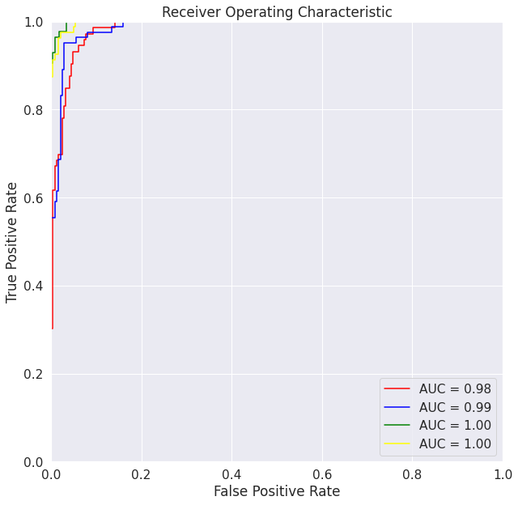  

* The test report is available in Report.ipynb

### Inference    
* The model with best check point is saved and loaded for inference      
* If all the class scores are below a threshold of 60% then it is considered as a negative sample   
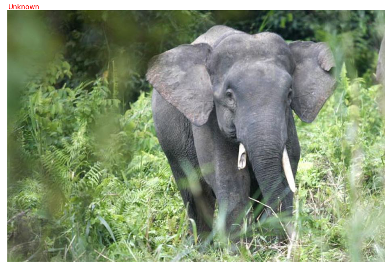 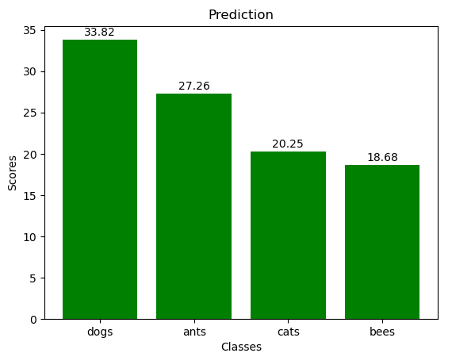     
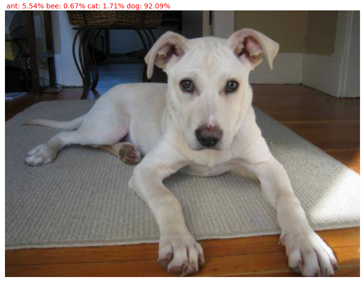 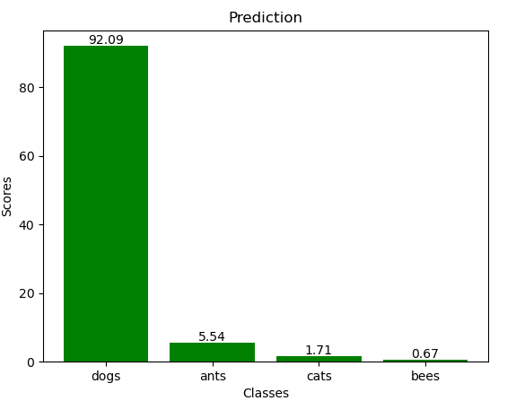     

Note: This is not a best model. The results can be further improved by hyper parameter tuning only

